# Data Analysis Agent

An agentic pipeline that takes a CSV file, analyzes it end-to-end, and produces a structured Markdown report with charts — fully automated using LangGraph and MCP tools,.

---

## Workflow

<!-- Replace the line below with your workflow diagram -->
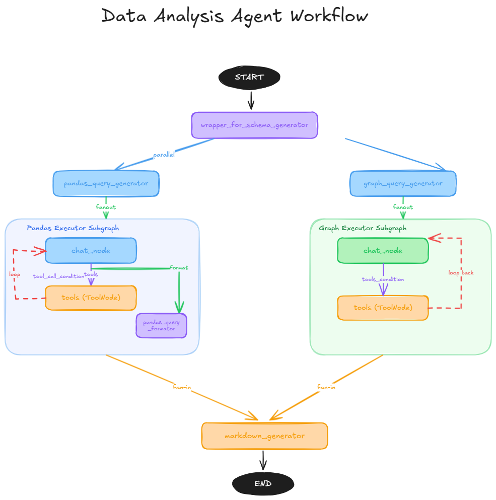

---

## How It Works

1. **Schema Generation** — The agent reads the uploaded CSV and generates a detailed natural-language schema by running pandas introspection queries via an MCP tool server.
2. **Query Planning** — Two parallel planners generate:
   - A list of pandas analysis queries (statistics, correlations, anomalies, etc.)
   - A list of chart/graph descriptions with assigned filenames
3. **Parallel Execution** — Both query sets are fanned out in batches and executed concurrently:
   - Pandas queries run through `workflow_for_pandas_query` and return structured results
   - Graph queries run through `workflow_for_graph_query`, generating and saving PNG charts
4. **Report Generation** — All results are consolidated into a polished Markdown report with embedded chart images.

---

## Project Structure

```
├── workflows/
│   ├── main.py                  # Orchestrator graph (LangGraph)
│   ├── schema_generator.py      # CSV schema extraction subgraph
│   ├── pandas_query_executor.py # Pandas analysis subgraph
│   └── graph_query_executor.py  # Matplotlib chart generation subgraph
├── mcp_server/
│   └── main.py                  # FastMCP server exposing Python execution tools
└── webapp/
    └── frontend.py              # Streamlit UI
```

---

## Tech Stack

| Component | Library / Service |
|---|---|
| Orchestration | LangGraph |
| Tool Execution | FastMCP (stdio transport) |
| LLM ↔ MCP Bridge | `langchain-mcp-adapters` |
| Data Analysis | pandas |
| Charting | Matplotlib |
| Persistence | SQLite (`AsyncSqliteSaver`) |
| Frontend | Streamlit |

---

## Setup

### Prerequisites

- Python 3.10+
- [`uv`](https://github.com/astral-sh/uv) (used to run the MCP server)

### Install dependencies

```bash
pip install -r requirements.txt
```

### Configure environment

Create a `.env` file in the project root:

```env
LANGSMITH_API_KEY=your_key_here   # optional, for tracing
other api keys for respective llm
```


### Run the app

```bash
streamlit run webapp/frontend.py
```

Upload a CSV file and click **Run Analysis Agent**. The report renders in the UI once the pipeline completes.

---

## MCP Tools

The MCP server exposes two execution tools:

| Tool | Description |
|---|---|
| `run_pandas_queries` | Executes multi-line pandas code via `exec()` and returns named variables |
| `run_graph_queries` | Executes a Matplotlib script and saves the output chart as PNG |

Both tools run with a configurable timeout (default: 10s).

---

## Output

- **Markdown report** saved to `data/markdown.md`
- **PNG charts** saved to the `data/` folder
- Report is rendered directly in the Streamlit UI after the run completes


# Example Output 1 - On Iris dataset 

# Iris Flower Dataset Analysis Report

## 📋 Overview
This report provides a comprehensive analysis of the Iris dataset, which contains measurements for 150 iris flowers across three different species: *Iris-setosa*, *Iris-versicolor*, and *Iris-virginica*. The goal of this analysis is to explore the physical characteristics of these species and identify which features best differentiate them.

---

## 🛠️ Dataset Overview

### Data Structure
The dataset is composed of 150 observations and 6 columns. It is a clean dataset with no missing values and no duplicate rows.

| Column | Data Type | Description |
| :--- | :--- | :--- |
| **Id** | `int64` | Unique identifier for each flower |
| **SepalLengthCm** | `float64` | Sepal length in centimeters |
| **SepalWidthCm** | `float64` | Sepal width in centimeters |
| **PetalLengthCm** | `float64` | Petal length in centimeters |
| **PetalWidthCm** | `float64` | Petal width in centimeters |
| **Species** | `string/object` | The species of the iris flower |

### Class Balance
The dataset is perfectly balanced, ensuring no bias toward any specific species during analysis.

| Species | Count | Percentage Contribution |
| :--- | :---: | :---: |
| Iris-setosa | 50 | 33.33% |
| Iris-versicolor | 50 | 33.33% |
| Iris-virginica | 50 | 33.33% |

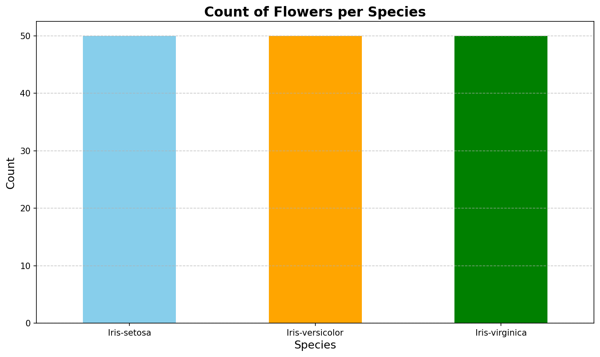

---

## 📊 Key Statistics

### Descriptive Summary
Detailed statistics reveal significant variations in petal dimensions, which likely serve as the primary discriminators between species.

| Metric | SepalLengthCm | SepalWidthCm | PetalLengthCm | PetalWidthCm |
| :--- | :---: | :---: | :---: | :---: |
| **Mean** | 5.84 | 3.05 | 3.76 | 1.20 |
| **Std Dev** | 0.83 | 0.43 | 1.76 | 0.76 |
| **Min** | 4.30 | 2.00 | 1.00 | 0.10 |
| **Median** | 5.80 | 3.00 | 4.35 | 1.30 |
| **Max** | 7.90 | 4.40 | 6.90 | 2.50 |

### Distribution and Normality
Analysis of skewness and kurtosis shows that the data is generally symmetric, though petal measurements exhibit platykurtic distributions (flatter peaks), indicating distinct grouping between the species.

| Feature | Skewness | Kurtosis |
| :--- | :---: | :---: |
| **SepalLengthCm** | 0.3149 | -0.5521 |
| **SepalWidthCm** | 0.3341 | 0.2908 |
| **PetalLengthCm** | -0.2745 | -1.4019 |
| **PetalWidthCm** | -0.1050 | -1.3398 |

### Outlier Detection
Using the IQR method, only **SepalWidthCm** exhibited outliers (4 instances). Z-score analysis identified one extreme data point (ID 16, *Iris-setosa*), specifically due to an unusually high sepal width of 4.4cm.

---

## 🔍 Visual Insights

### Feature Distributions
The histograms below illustrate the overall spread of measurements. Petal length and width show clear gaps or bimodality, highlighting the separation between *Setosa* and the other species.

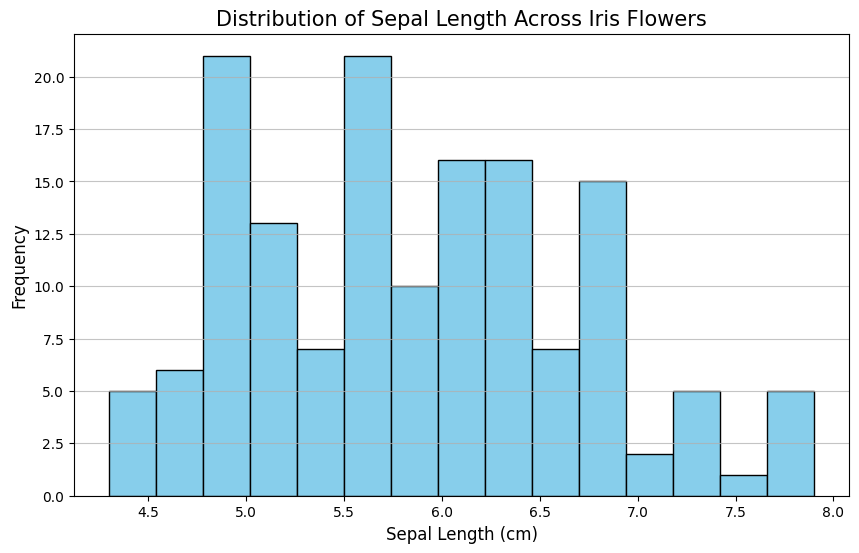
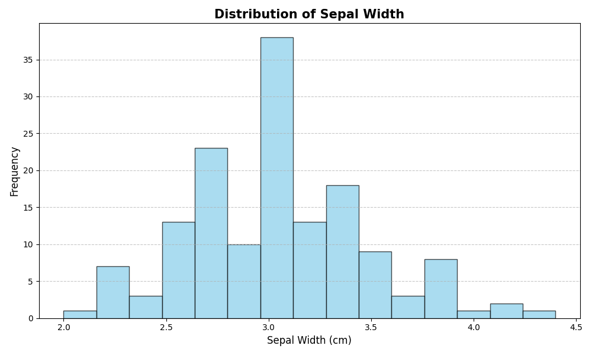
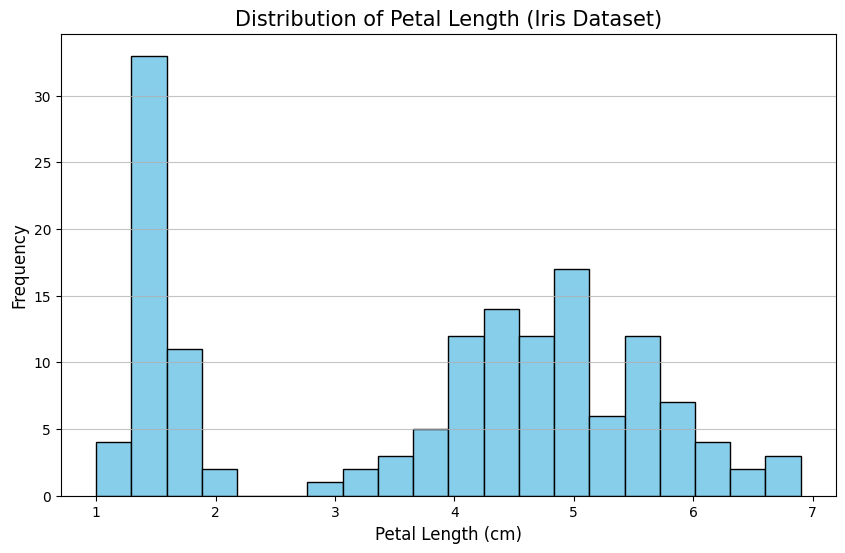
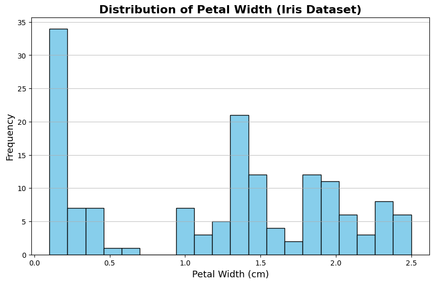

### Species Comparison
Box plots and violin plots emphasize that *Iris-setosa* is significantly smaller in petal size, while *Iris-virginica* generally possesses the largest dimensions.

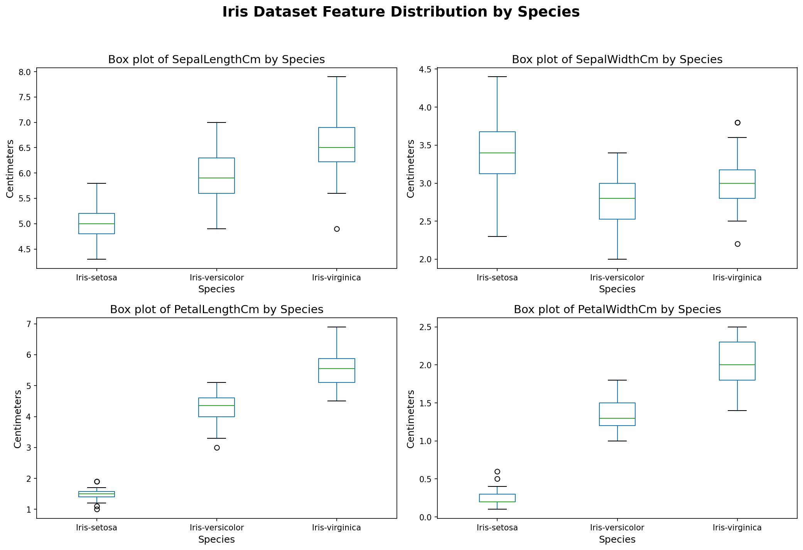
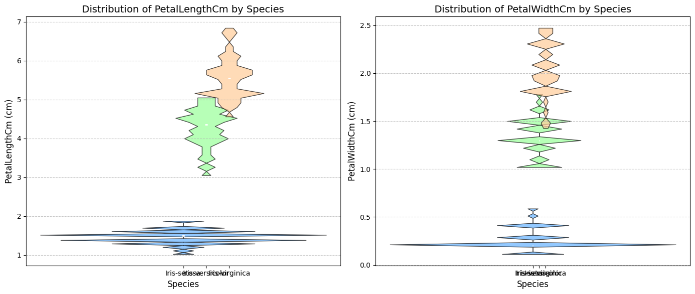

### Correlation and Clustering
There is a very strong positive correlation between **Petal Length and Petal Width (0.96)**. The scatter plots and pair plots confirm that petal measurements are the most effective features for clustering the three species.

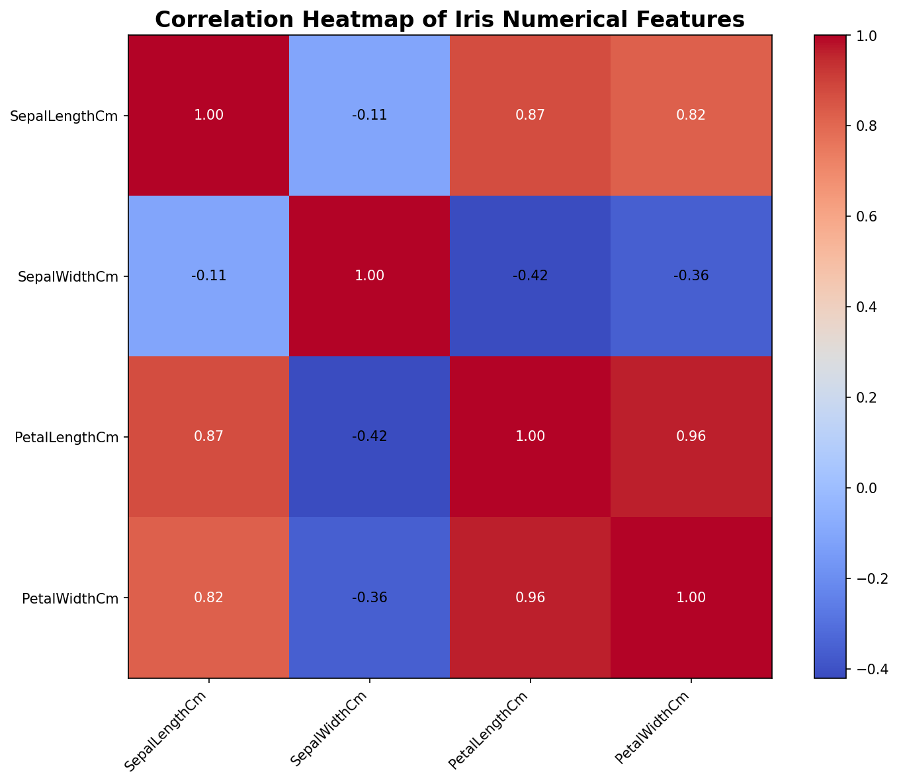
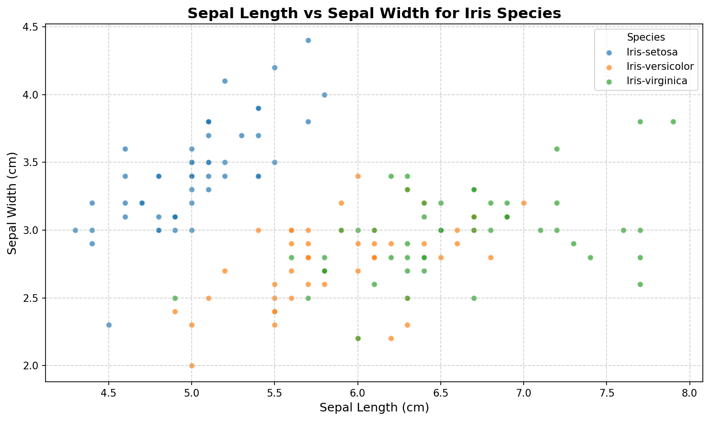
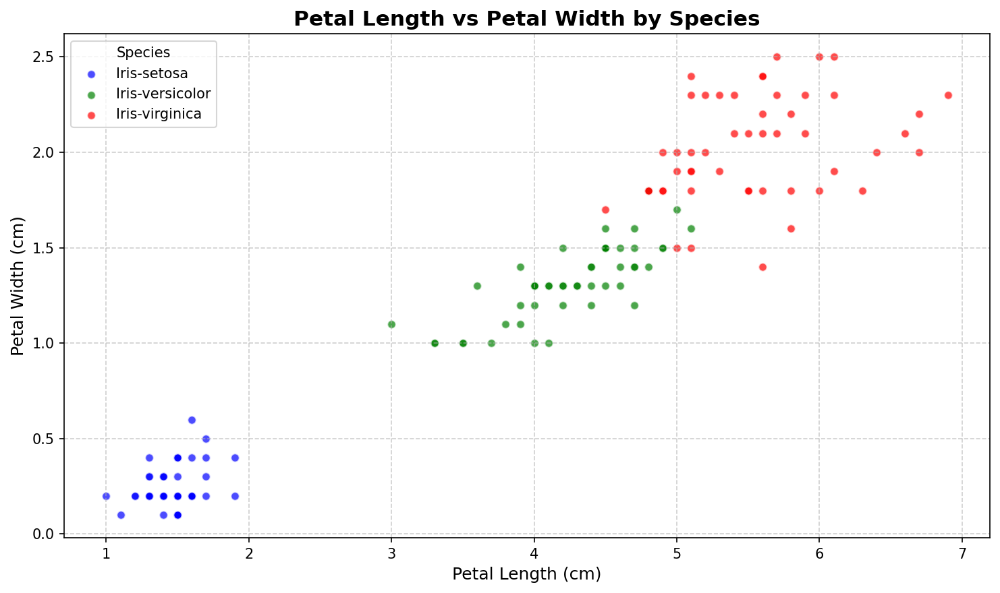
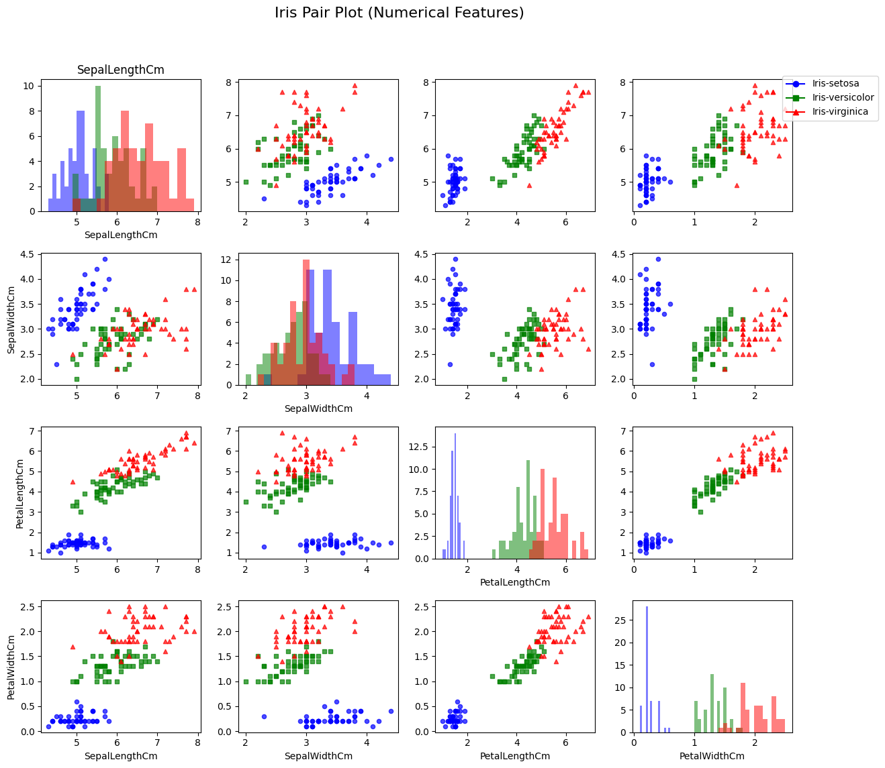

---

## 🧪 Advanced Comparative Analysis

### Species Averages
Comparing the mean measurements reveals a clear hierarchy in size across the three species.

| Species | PetalLengthCm | PetalWidthCm | SepalLengthCm | SepalWidthCm |
| :--- | :---: | :---: | :---: | :---: |
| **Iris-setosa** | 1.464 | 0.244 | 5.006 | 3.418 |
| **Iris-versicolor** | 4.260 | 1.326 | 5.936 | 2.770 |
| **Iris-virginica** | 5.552 | 2.026 | 6.588 | 2.974 |

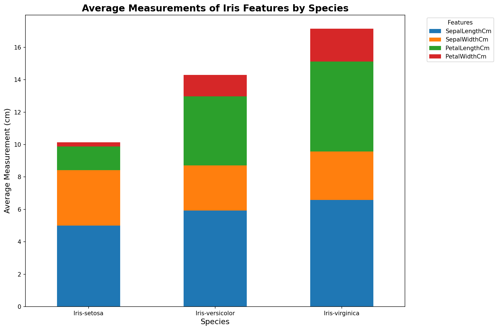

### Derived Metrics & Segmentation
- **Petal Ratio:** A ratio of Petal Length to Width is an excellent differentiator for *Iris-setosa* (Mean Ratio: 7.08) compared to others (~3.0).
- **Petal Area Segmentation:** By segmenting flowers into 'Small', 'Medium', and 'Large' based on petal area, we found a nearly perfect alignment with species:
    - **Small** $\rightarrow$ 100% *Iris-setosa*
    - **Medium** $\rightarrow$ 94% *Iris-versicolor*
    - **Large** $\rightarrow$ 94% *Iris-virginica*

### Final Observations
- **Most Consistent:** *Iris-versicolor* has the most consistent sepal width (lowest variance).
- **Extreme Boundaries:** The shortest sepal lengths are exclusively found in *Iris-setosa*, while the longest are exclusively *Iris-virginica*.

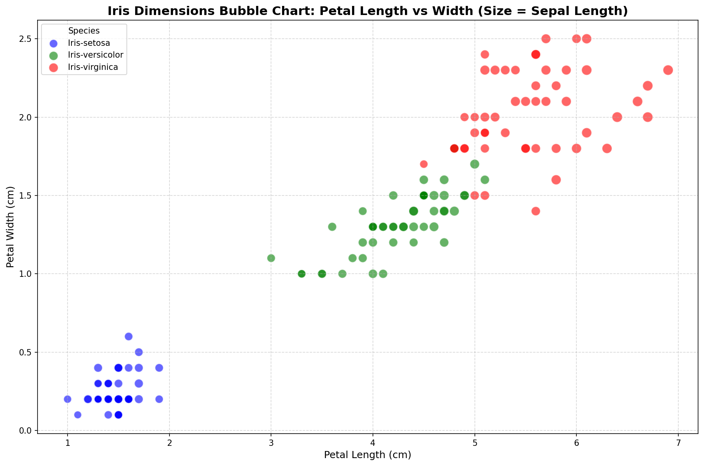
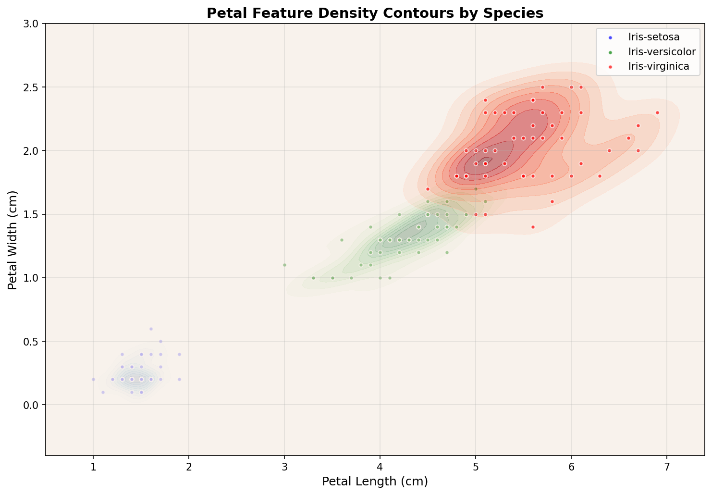

---


# Example Output 2 - On Transactions dataset

# Financial Transactions Analysis Report

## 📌 Overview
This report provides a comprehensive analysis of the `transactions.csv` dataset, which tracks financial logs recorded by **Pankaj Maulekhi**. The dataset consists of 267 entries across 9 columns, primarily focusing on expenses and income tracked via UPI in GBP currency.

---

## 📊 Dataset Overview

### Data Structure
The dataset contains financial records with the following characteristics:
- **Total Rows:** 267
- **Total Columns:** 9
- **Currency:** 100% GBP
- **Primary Payment Method:** UPI

### Data Quality Assessment
| Column | Null Count | Percentage (%) | Status |
| :--- | :--- | :--- | :--- |
| **Labels** | 267 | 100.0% | Empty |
| **Note** | 216 | 80.9% | Sparse |
| **Other Columns** | 0 | 0.0% | Complete |

**Key Findings:**
- There are **0 duplicate rows**, ensuring data integrity.
- The `Date` column is clean, spanning from **March 16, 2025, to March 14, 2026**, with no future-dated anomalies.
- The dataset follows an **Accounting Convention** where Expenses are recorded as negative values and Income as positive values.

---

## 📉 Key Statistics & Univariate Analysis

### Transaction Amount Summary
| Metric | Value |
| :--- | :--- |
| **Mean** | -0.867 |
| **Median** | -0.513 |
| **Std Deviation** | 1.803 |
| **Minimum** | -12.641 |
| **Maximum** | 18.673 |

### Transaction Distribution
- **Expenses:** 266 transactions
- **Income:** 1 transaction

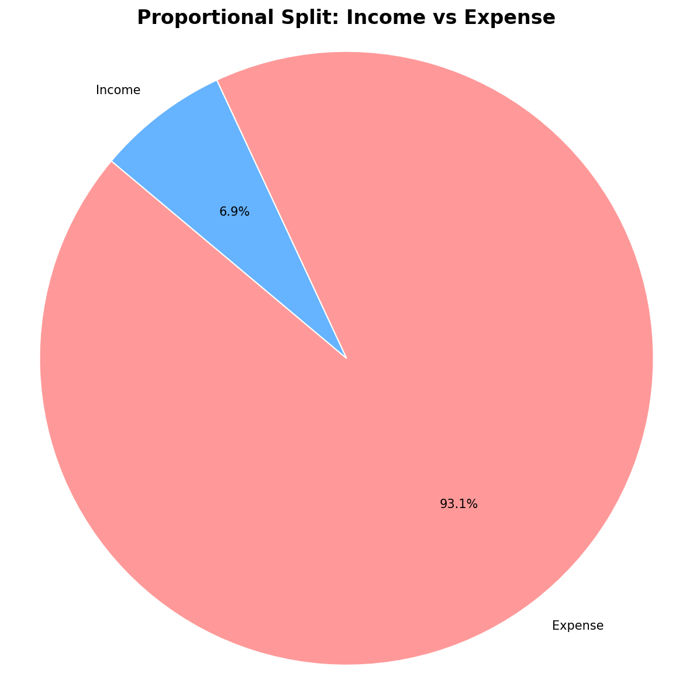
*The pie chart highlights a massive imbalance, with the dataset consisting almost entirely of expenses.*

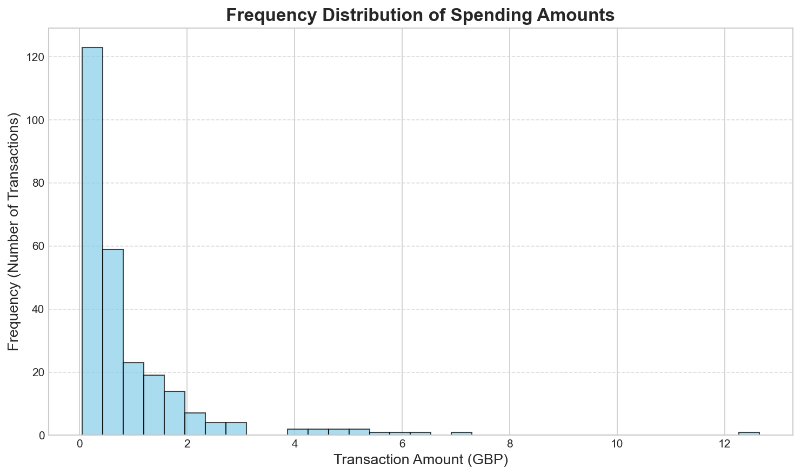
*The histogram reveals the common spending ranges, showing a concentration of small-value transactions.*

---

## 📂 Spending Insights

### Category Frequency
There are **14 unique categories**. The most frequent categories are:
1. **Food & Drink:** 186 occurrences
2. **Shopping:** 20 occurrences
3. **Other:** 15 occurrences
4. **Education:** 14 occurrences
5. **Groceries:** 11 occurrences

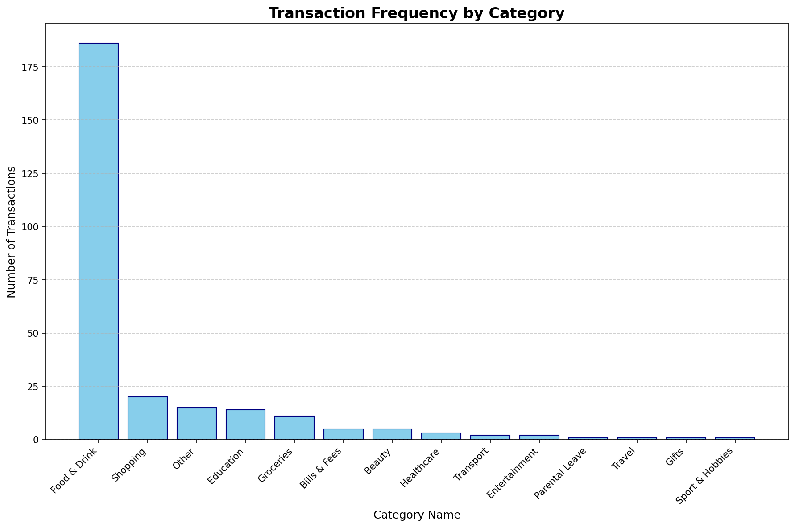

### Expenditure by Category
| Category name | Total Expenditure |
| :--- | :--- |
| **Food & Drink** | -127.95 |
| **Shopping** | -60.48 |
| **Bills & Fees** | -13.44 |
| **Education** | -10.88 |
| **Other** | -9.80 |
| **Groceries** | -9.15 |
| **Healthcare** | -8.56 |
| **Entertainment** | -3.43 |
| **Beauty** | -2.36 |
| **Sport & Hobbies** | -1.69 |
| **Transport** | -1.18 |
| **Travel** | -1.10 |
| **Gifts** | -0.21 |

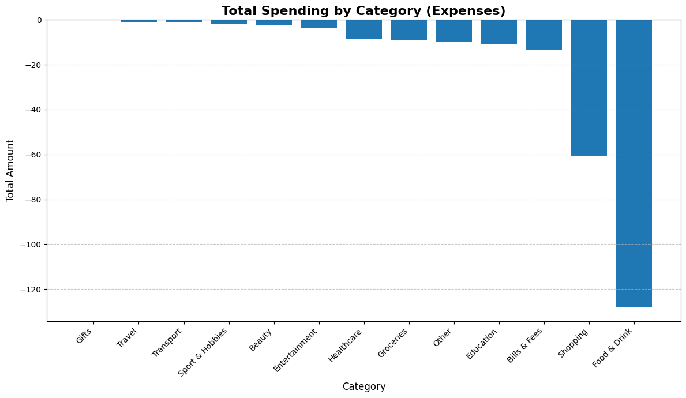

**Insight:** **Food & Drink** and **Shopping** are the dominant cost drivers, accounting for approximately **75%** of the total overall expenditure.

---

## 🕒 Time-Series & Trend Analysis

### Monthly Trends
- **Highest Spending Months:** August 2025 (~-37.10) and January 2026 (~-35.93).
- **Gaps in Data:** No recorded expenses in May and June 2025.

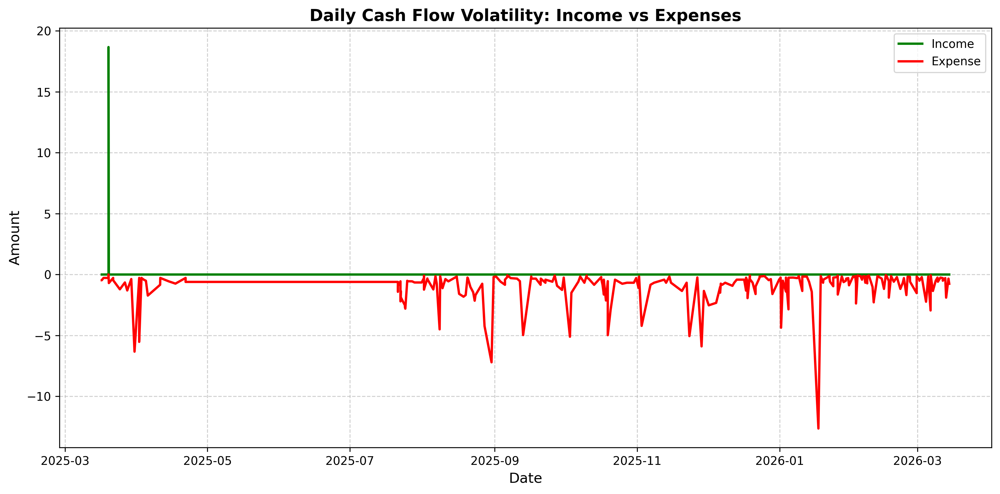
*The line chart visualizes the volatility of daily cash flows.*

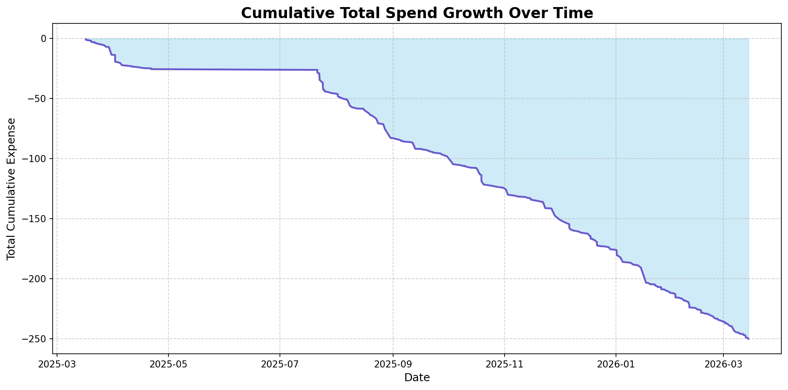
*The area chart tracks the growth of total spending over the observed period.*

---

## ⚙️ Advanced Statistical Analysis

### Financial Health Metrics
| Metric | Value |
| :--- | :--- |
| **Avg Monthly Burn Rate (Expense)** | -22.75 |
| **Avg Monthly Income** | 18.67 |
| **Net Monthly Cashflow Difference** | 4.08 |

### Volatility Analysis (Spending Consistency)
| Category | Variance | Coeff. of Variation | Stability |
| :--- | :--- | :--- | :--- |
| **Shopping** | 7.21 | -0.88 | Most Volatile (Absolute) |
| **Groceries** | 3.35 | -2.20 | High Relative Volatility |
| **Entertainment** | 0.09 | -0.18 | Most Stable |

### Pareto Analysis
Interestingly, the 80/20 rule does not apply here. Approximately **92% of categories** are required to reach the 80% cumulative expense mark, indicating that spending is distributed across most categories rather than concentrated in a tiny few.

---

## 💡 Custom Insights

- **Net Cash Flow:** The total net impact is **268.89** (Total Income - Total Expenses).
- **Documentation Gap:** Only **14.29%** of high-value transactions (top 10%) have associated notes. However, transactions with notes tend to have a higher average value (-1.58 vs -0.70), suggesting a slight correlation between expense size and the likelihood of adding a description.
- **Spending Hierarchy:**
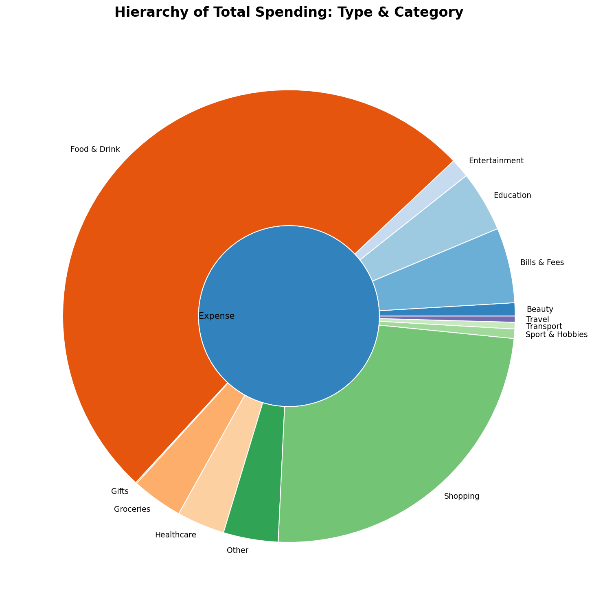

## 🏁 Conclusion
The financial profile is characterized by a high volume of low-to-mid-value expenses, primarily managed through **UPI**. The primary spending drivers are **Food & Drink** and **Shopping**, with a relatively stable spending pattern in entertainment but high volatility in shopping and groceries.

